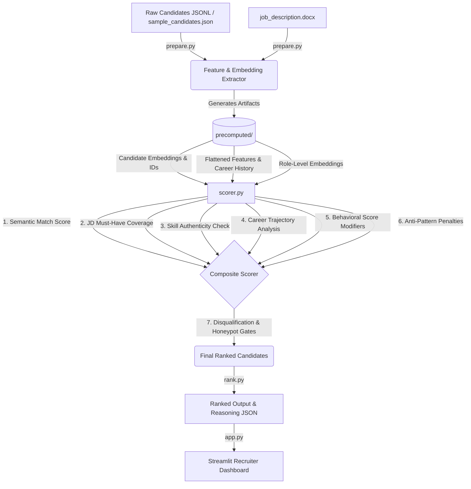

# DeepMatch

AI-Powered Candidate Discovery & Ranking Platform

DeepMatch is an intelligent candidate ranking system designed to help recruiters identify the most relevant candidates from large talent pools. By combining semantic understanding, career trajectory analysis, behavioral intelligence, skill authenticity verification, and profile integrity checks, DeepMatch generates explainable candidate rankings that reduce manual screening effort and improve hiring efficiency.

---

## Problem Statement

Recruiters often face challenges when evaluating large volumes of applications:

* Manual resume screening is time-consuming
* Keyword-based filtering misses strong candidates
* Candidate quality assessment is inconsistent
* Inflated or misleading profiles are difficult to detect
* Identifying the best fit requires significant effort

DeepMatch addresses these challenges by transforming candidate profiles into structured intelligence and generating data-driven ranking scores.

---

## Key Features

### Semantic Candidate Matching
Uses transformer-based embeddings to measure alignment between candidate profiles and job descriptions.

### Skill Authenticity Analysis
Evaluates whether claimed skills are supported by experience duration, proficiency levels, endorsements, and verified assessment signals.

### Career Trajectory Evaluation
Analyzes career progression patterns to identify candidates demonstrating meaningful growth and role advancement.

### Behavioral Intelligence
Incorporates recruiter engagement and activity-based signals to improve ranking quality.

### Profile Integrity Checks
Detects suspicious or inconsistent profiles through employment overlap detection, graduation-to-career timeline validation, duration mismatch analysis, and unrealistic expertise claims.

### Explainable Rankings
Provides evidence-based reasoning behind candidate scores, enabling transparent recruiter decision-making.

---

## 🏗️ System Architecture

The pipeline divides responsibilities across distinct layers:



### File Structure & Descriptions

| File / Directory | Description |
|---|---|
| **[`prepare.py`](file:///c:/Users/dsouz/Desktop/DeepMatch/redrob-ranker-main/prepare.py)** | Text preparation, sentence-transformer embedding generation, profile integrity heuristic extraction, and saving of precomputed assets. |
| **[`scorer.py`](file:///c:/Users/dsouz/Desktop/DeepMatch/redrob-ranker-main/scorer.py)** | The core intelligence scoring library (side-effect-free, no file I/O, no print statements, 59/59 self-tests). |
| **[`rank.py`](file:///c:/Users/dsouz/Desktop/DeepMatch/redrob-ranker-main/rank.py)** | Candidate ranking and result generation pipeline (to be implemented). |
| **[`app.py`](file:///c:/Users/dsouz/Desktop/DeepMatch/redrob-ranker-main/app.py)** | Recruiter-facing Streamlit application and visualization layer (to be implemented). |
| **`requirements.txt`** | Project dependencies. |

---

## 📊 Multi-Vector Scoring Architecture

Candidates are graded on a composite score in the range `[0.0, 1.0]` (rounded to 4 decimal places) using five weighted dimensions combined with anti-pattern penalties and strict gate filters:

$$Score = \text{Clamp}\left( \sum (W_i \times S_i) - \text{Penalty}, 0.0, 1.0 \right)$$

### 1. Score Dimensions & Weight Budget

| Weight | Dimension | Method & Scoring Details |
|---|---|---|
| **30%** | **Semantic Fit** (`semantic_score`) | Cosine similarity between candidate text blob (headline, summary, and all role descriptions) and the JD embedding. Vectors are generated using HuggingFace's `all-MiniLM-L6-v2` (384-dimensional). |
| **20%** | **JD Coverage** (`jd_requirement_coverage`) | Case-insensitive verification of keyword coverage across 4 must-have categories (Embeddings Retrieval, Vector Databases, Strong Python, and Evaluation Frameworks). |
| **20%** | **Behavioral Score** (`behavioral_score`) | Synthesizes Redrob platform signals: response rates, interview completion, acceptance rates, trust checks (verified phone, email, LinkedIn), and GitHub activity. Activates an active candidate bonus (`+0.05`) or an inactivity penalty (`-0.10`). |
| **15%** | **Career Trajectory** (`trajectory_score`) | Compares the candidate's career progression (role embeddings chronological sequence) against the target JD. Weighted with exponential decay for older roles (newest: `1.0`, oldest: `0.2`). |
| **15%** | **Skill Authenticity** (`skill_authenticity`) | Cross-validates claimed skills against minimum required duration mappings (e.g., Expert claims must show $\ge 36$ months practice). Integrates verified assessment score boosts and log-saturated peer endorsement signals. |

### 2. Hard Gate Disqualifications
If a candidate triggers any of the following gates, their score is immediately forced to **`0.0`**:

1. **Disqualification Checks (`is_disqualified`)**:
   * `pure_research_no_production`: Strictly research background, no corporate/production code deployment.
   * `ai_only_langchain_under_12mo`: Exclusive reliance on LangChain or agent toy-projects for under 12 months.
   * `no_hands_on_code_18mo`: Has not touched hands-on programming in the last 1.5 years.
   * `consulting_only_career`: History confined to advisory or consulting services.
   * `cv_speech_robotics_no_nlp`: Computer Vision / Robotics engineer lacking required NLP experience.
2. **Honeypot Integrity Checks (`honeypot_score >= 2`)**:
   * `has_overlapping_dates`: Employment periods overlap impossibly.
   * `started_before_graduating`: Career started $\ge 1$ year before graduation date.
   * `duration_mismatch_count`: Significant duration discrepancies detected in role claims.
   * *Extreme Skill Inflation*: A skill claimed at "Expert" level with $\le 2$ months of practice.

### 3. Anti-Pattern Penalties (up to `-0.25`)
Applied directly to the pre-clamped raw score:
* **Title Chaser (`-0.15` penalty)**: Triggered if a candidate has $\ge 3$ jobs, a majority of tenures under 18 months, and consecutive roles that progress rapidly along a recognition ladder (Engineering, ML, Management, etc.).
* **Framework Enthusiast (`-0.10` penalty)**: Triggered if a candidate's profile is loaded with hobbyist keywords ("poc", "tutorial", "toy project", "chatbot") but contains no mention of production keywords.

---

## ⚡ Scale-Ready Performance Engineering

Standard matrix similarity implementations struggle to scale. At $N = 100,000$, standard operations are optimized to prevent out-of-memory (OOM) crashes and CPU bottlenecks:

* **O(N) Peak Memory Dedup**: The default implementation for `flag_duplicates` would allocate a **40 GB float32 matrix** (`100,000 × 100,000 × 4 bytes`). This project uses a **memory-safe chunking algorithm** that limits peak memory overhead to **under 200 MB** by processing rows in blocks (default 500) and iterating only through upper-triangular index pairs.
* **Batch Vectorization**: Vectorized batch matrix multiplication ($X_{cand} \cdot y_{jd}^T$) replaces slow per-candidate loops for semantic checks.
* **Production Recommendation**: When dataset size exceeds 50,000, `scorer.py` logs a warning suggesting integration of **FAISS** (`faiss-cpu`) index searches with L2-normalized unit vectors for sub-second similarity matching.

---

## 📂 Precomputed Artifact Directory (`precomputed/`)

Data prepared by `prepare.py` is saved in the `precomputed/` folder for fast downstream consumption by the ranking engine:

```text
precomputed/
├── candidate_embeddings.npy  # (N x 384) numpy matrix representing candidate profile text embeddings
├── candidate_features.json    # Map of candidate_id -> structured feature dict (yoe, graduation, overlaps, etc.)
├── candidate_ids.txt         # Text file listing candidate IDs in index order corresponding to .npy rows
├── jd_embedding.npy          # (1 x 384) numpy array representing the target job description embedding
└── role_embeddings.json      # Map of candidate_id -> list of role embeddings (newest to oldest chronological)
```

---

## 🚀 Getting Started

### 1. Install Dependencies
Clone the repository and install the verified package requirements:
```bash
pip install -r requirements.txt
```

### 2. Prepare Data Assets
Place raw candidates data in your configured dataset path and execute the preparation pipeline to build all embeddings and feature assets:
```bash
python prepare.py
```

### 3. Run Self-Test Suite & Validation Checks
The library includes a robust self-test suite checking the mathematical behavior, dual-schema integration, boundary guards, and memory-safe dedup logic. 

Run the test suite:
```bash
# Set UTF-8 encoding environment variable on Windows to display test step characters cleanly
$env:PYTHONUTF8=1
python scorer.py
```

Expected output:
```text
Results: 59/59 checks passed
All checks passed.
```

---

## 🛠️ API Reference (`scorer.py`)

The scoring module exposes clean, type-hinted helper functions:

```python
from scorer import (
    semantic_score,
    is_disqualified,
    disqualification_detail,
    honeypot_score,
    jd_requirement_coverage,
    skill_authenticity,
    trajectory_score,
    behavioral_score,
    anti_pattern_penalty,
    final_score,
    flag_duplicates,
    generate_reasoning
)

# 1. Compute baseline semantic fit
sem = semantic_score(candidate_emb, jd_emb)

# 2. Check strict filters & integrity gates
is_disq = is_disqualified(candidate_raw, candidate_features)
detail = disqualification_detail(candidate_raw, candidate_features)
honeypots = honeypot_score(candidate_raw, candidate_features)

# 3. Assess alignment & quality
coverage = jd_requirement_coverage(text_blob, candidate_raw["skills"])
authenticity = skill_authenticity(candidate_raw["skills"])
trajectory = trajectory_score(role_embs, jd_emb)
behavior = behavioral_score(candidate_raw.get("redrob_signals", {}))
penalty = anti_pattern_penalty(candidate_raw["career_history"], text_blob)

# 4. Synthesize final score [0.0 - 1.0]
score = final_score(sem, coverage, trajectory, authenticity, behavior, penalty, is_disq, honeypots)

# 5. Extract deterministic reasoning
reasoning = generate_reasoning(candidate_raw, {"final": score, "semantic_fit": sem, ...})
```

---

## 🎨 Design Goals & Roadmap

### Design Goals
* Accurate candidate-job matching
* Explainable ranking decisions
* Detection of misleading profiles
* Scalable architecture for large candidate pools
* Recruiter-friendly outputs

### Future Roadmap
* Interactive recruiter dashboard
* Advanced duplicate candidate detection
* Candidate recommendation engine
* Real-time ranking updates
* Scalable vector search integration
* Enhanced explainability and analytics

---

## 🏆 Challenge Context

DeepMatch was developed as part of an AI-powered candidate discovery and ranking challenge focused on improving recruiter productivity through intelligent talent matching and automated candidate evaluation.
